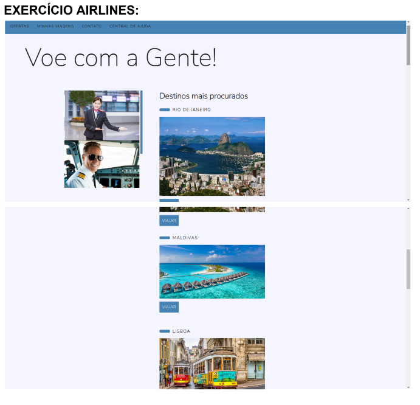
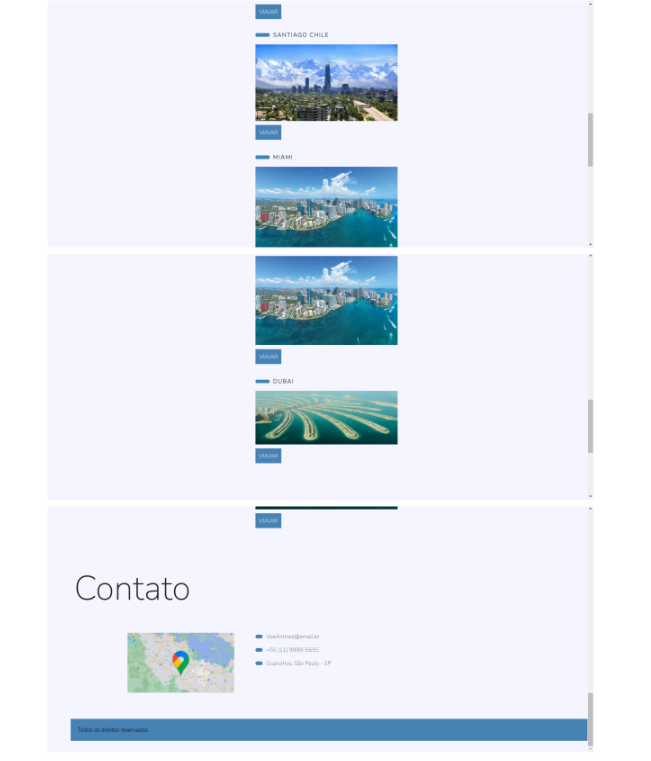

# EXERCÍCIO AIRLINES ✈️
## Projeto de Treinamento de Front-End - Academy One
Este projeto foi criado pelo Academy One para interessados em desenvolvimento front-end. O objetivo é seguir as instruções e criar telas responsivas usando HTML e CSS. 

 

